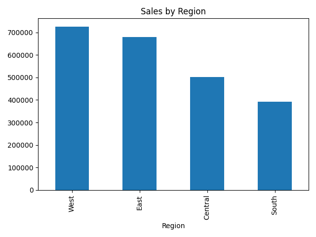
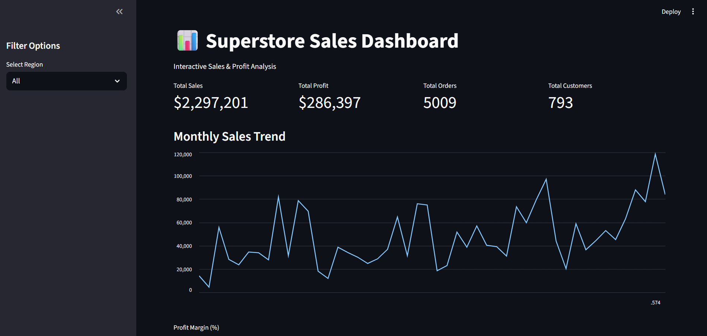
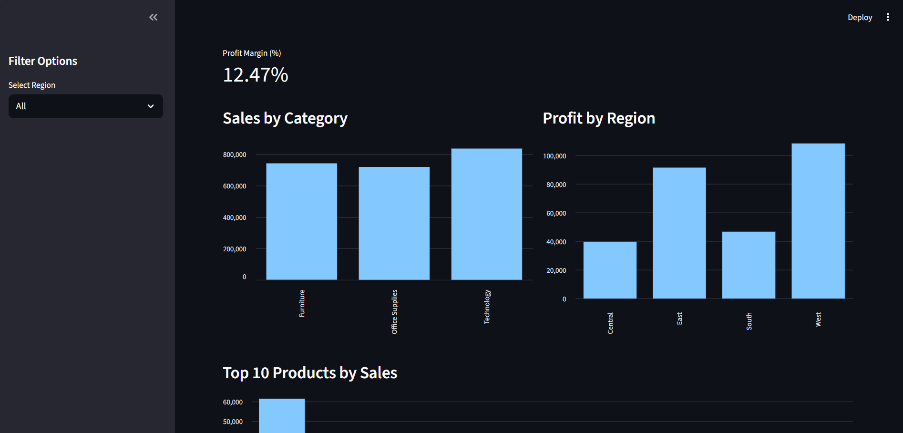
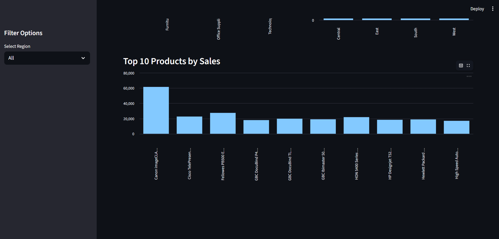

## 📊 Superstore Sales & Profit Performance Analysis
### 📌 Executive Summary

This project performs end-to-end retail sales analysis on a Superstore dataset to uncover key business insights, evaluate profitability drivers, and support data-driven decision-making using Python and Power BI.

The analysis identifies discount-driven profit loss, region-wise performance differences, and high-performing product categories, followed by an interactive dashboard for executive reporting.


### 🎯 Business Objectives

- Analyze overall sales and profit performance

- Identify loss-making categories and sub-categories

- Evaluate the impact of discounts on profitability

- Compare performance across regions and customer segments

- Build a predictive model for sales forecasting


### 🛠 Tools & Technologies

- Python (Pandas, NumPy, Matplotlib, Seaborn)
- Scikit-learn (Linear Regression, Random Forest)
- Power BI (Interactive Dashboard)
- Streamlit (Interactive Web Application)
- Jupyter Notebook
- Git & GitHub


## 📂 Project Workflow
### 1️⃣ Data Loading

- Imported raw Superstore dataset

- Performed structural inspection

- Checked data types and null values

### 2️⃣ Data Cleaning

- Handled missing values

- Removed duplicate records

- Converted date columns to datetime format

- Validated and standardized numerical columns

- Created derived metrics (e.g., Profit Margin)

### 3️⃣ Exploratory Data Analysis

- Monthly Sales Trend Analysis

- Region-wise Sales & Profit comparison

- Category & Sub-category Performance

- Customer Segment Contribution

- Discount vs Profit Relationship

- Profit Margin Analysis

- Loss-making Product Identification

### 4️⃣ Business Insights

- Discounts above 30% significantly reduce profitability.

- Technology category generates the highest profit margin.

- Furniture category shows comparatively lower profitability.

- West region leads in both revenue and profit contribution.

- Certain sub-categories consistently operate at negative margins.

### 5️⃣ Machine Learning Model (NEW)

- Two regression models were implemented to predict Sales:

##### Models Used:

- Linear Regression

- Random Forest Regressor


##### Evaluation Metrics:

- R² Score: (Add your actual value)

- MAE: (Add your value)

- RMSE: (Add your value)

##### Key Findings:

- Random Forest outperformed Linear Regression in prediction accuracy.

- Quantity and Discount significantly influence Sales prediction.

- Feature importance analysis highlights major sales drivers.

### 📊 Key Performance Indicators

💰 Total Sales: 2.30M

📈 Total Profit: 286.40K

📦 Total Orders: 5009

👥 Total Customers: 793

### 📊 Power BI Dashboard

The interactive dashboard includes:

- Executive KPI Cards

- Monthly Sales Trend

- Sales by Region

- Profit by Region

- Profit by Category

- Discount Impact on Profit

- Customer Segment Analysis

- Profit by Sub-Category

- Interactive Filters & Drill-down Analysis




---

## 🌐 Streamlit Interactive Web Application

An interactive web dashboard was developed using Streamlit to provide dynamic filtering and real-time KPI analysis.

### Features:

- Region-based filtering
- Dynamic KPI updates
- Monthly Sales Trend visualization
- Sales by Category analysis
- Profit by Region breakdown
- Discount vs Profit relationship
- Top 10 Products by Sales
- Profit Margin calculation

### ▶️ Run Locally

```bash
pip install -r requirements.txt
streamlit run app.py
```
#### The application will open at:
```
http://localhost:8501
```
### 📸 Streamlit Dashboard Preview




### 💡 Business Recommendations

- Limit discount strategies beyond 25–30% to avoid profit erosion.

- Re-evaluate pricing strategy for loss-making sub-categories.

- Focus marketing efforts on high-margin Technology products.

- Improve operational strategy in low-performing regions.

- Implement data-driven discount optimization policies.


### 📁 Project Structure
```
Superstore_Sales_Analysis/
│
├── dataset/
├── notebooks/
│   ├── 01_data_loading.ipynb
│   ├── 02_data_cleaning.ipynb
│   ├── 03_exploratory_analysis.ipynb
│   ├── 04_business_insights.ipynb
│   └── 05_regression_model.ipynb
│
├── visuals/
├── powerbi_dashboard.pbix
├── README.md
└── requirements.txt
```

### 🚀 Future Improvements

- Implement Time Series Forecasting (ARIMA / Prophet)

- Add Customer Segmentation using K-Means Clustering

- Deploy interactive Streamlit web application

- Automate monthly report generation

- Add hyperparameter tuning for model optimization